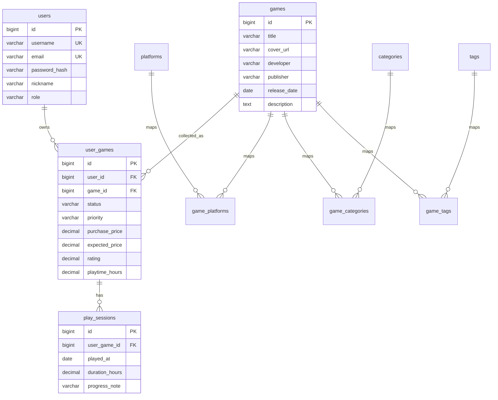

# GameVault ER 图与关系说明

## ER 图

## 关系说明

- 用户和个人游戏库是一对多关系。
- 游戏和个人游戏库是一对多关系，同一游戏可被多个用户收藏。
- 游戏和平台、类型、标签是多对多关系，通过关联表实现。
- 个人游戏库和游玩日志是一对多关系。
- `user_games` 使用 `user_id + game_id` 联合唯一约束，防止同一用户重复添加同一游戏。
